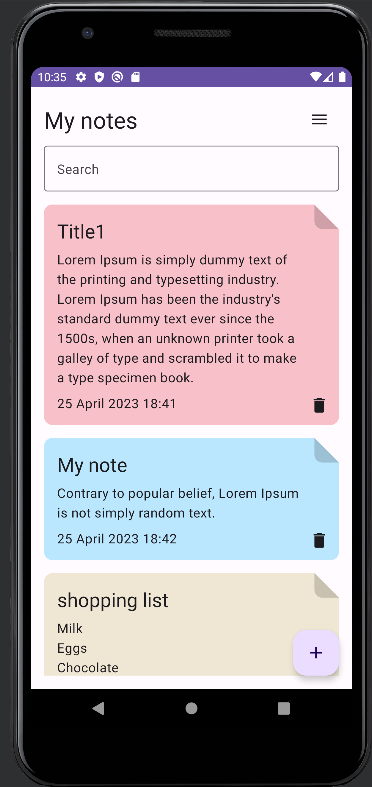
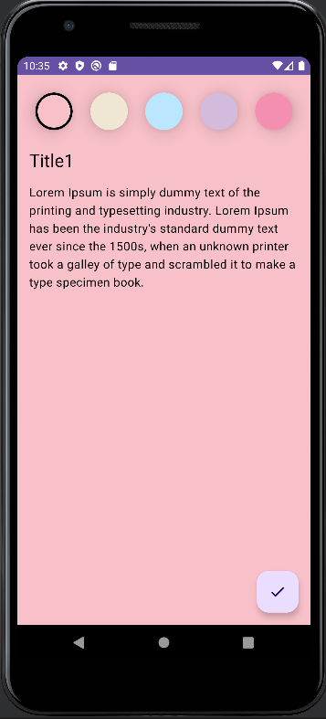
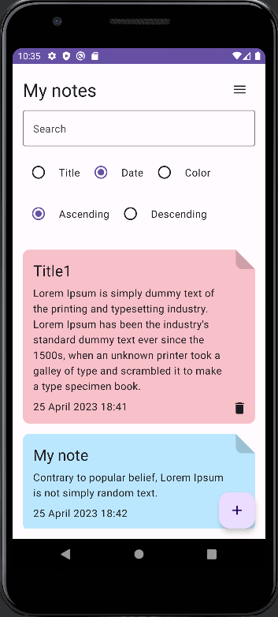
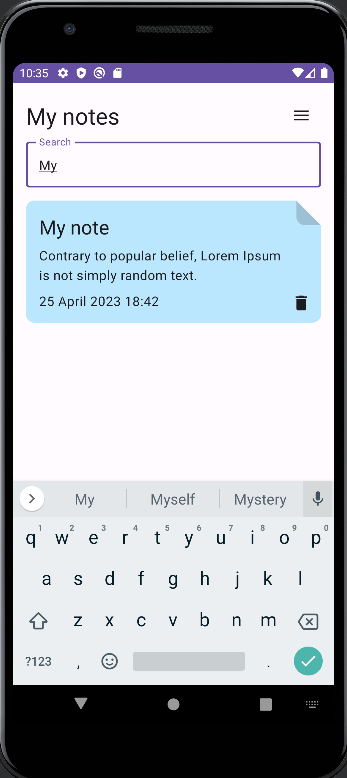
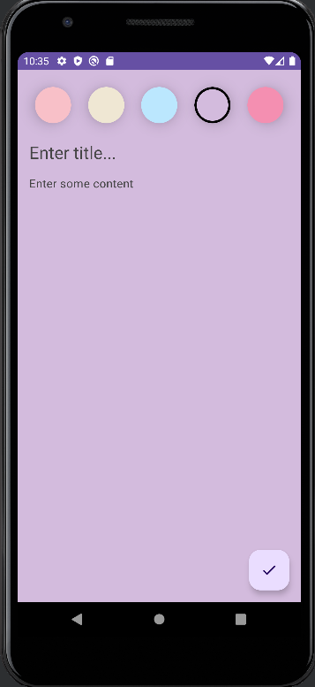
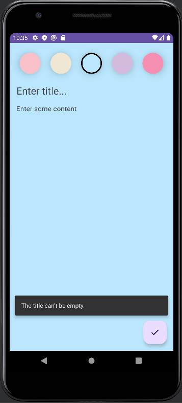

# Notes App

Notes App to prosta, ale funkcjonalna aplikacja do tworzenia i zarządzania notatkami, napisana w języku Kotlin z wykorzystaniem architektury Clean Architecture oraz popularnych frameworków Jetpack Compose, Room i Dagger Hilt.

Dzięki tej aplikacji użytkownik może swobodnie dodawać, usuwać i sortować notatki po tytule, a także wyszukiwać te, których tytuł zawiera określone słowo lub frazę. Warto zwrócić uwagę na możliwość wyboru koloru dla każdej notatki, co pozwala na łatwe i intuicyjne odróżnianie ich od siebie.

Notes App została stworzona z myślą o prostocie i użyteczności, oferując jednocześnie nowoczesne i zaawansowane rozwiązania technologiczne. Dzięki wykorzystaniu architektury Clean Architecture oraz popularnych narzędzi programistycznych, aplikacja jest łatwa w utrzymaniu i rozbudowie, a jednocześnie zapewnia wysoką wydajność i niezawodność.

## Wykorzystane technologie i narzędzia
- Kotlin
- Jetpack Compose
- MVVM
- Clean Architecture
- Room
- Dagger Hilt
- Coroutines
- Android Studio

## Funkcjonalności

Aplikacja pozwala na:

- Dodawanie notatki: użytkownik może dodać nową notatkę, uzupełniając jej tytuł, treść oraz wybierając kolor notatki.
- Usuwanie notatki: użytkownik może usunąć wybraną notatkę.
- Sortowanie notatek: użytkownik może sortować notatki po dacie lub tytule, zarówno rosnąco, jak i malejąco.
- Wyszukiwanie notatek: użytkownik może wyszukać notatkę po jej tytule.
- Wybór koloru dla notatki: użytkownik może wybrać kolor dla każdej notatki, aby łatwiej je odróżniać.

## Opis architektury
Projekt jest zbudowany zgodnie z zasadami architektury Clean Architecture. Podzielony jest na warstwy:

- Presentation: zawiera kod związany z interfejsem użytkownika i prezentacją danych.
- Domain: zawiera logikę biznesową i encje aplikacji.
- Data: zawiera implementacje interfejsów repozytoriów oraz logikę dostępu do danych.

## Autor
##### Autor: Natalia Kamińska
Aplikacja oparta jest na pracach Philipp Lackner (https://github.com/philipplackner), które zostały wykorzystane jako punkt wyjścia do stworzenia własnej implementacji z użyciem Clean Architecture, Jetpack Compose, Room i Dagger Hilt.

## Screenshoty

  
  
  
  
  
  

